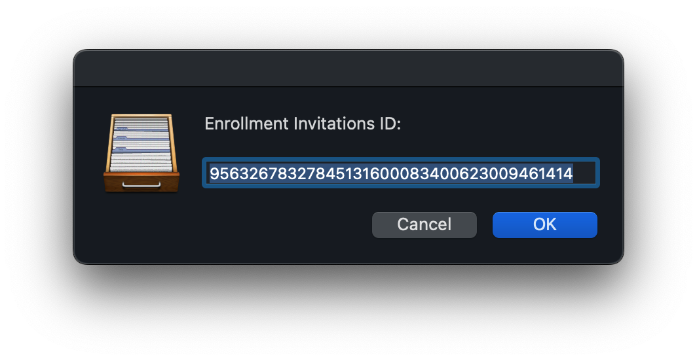
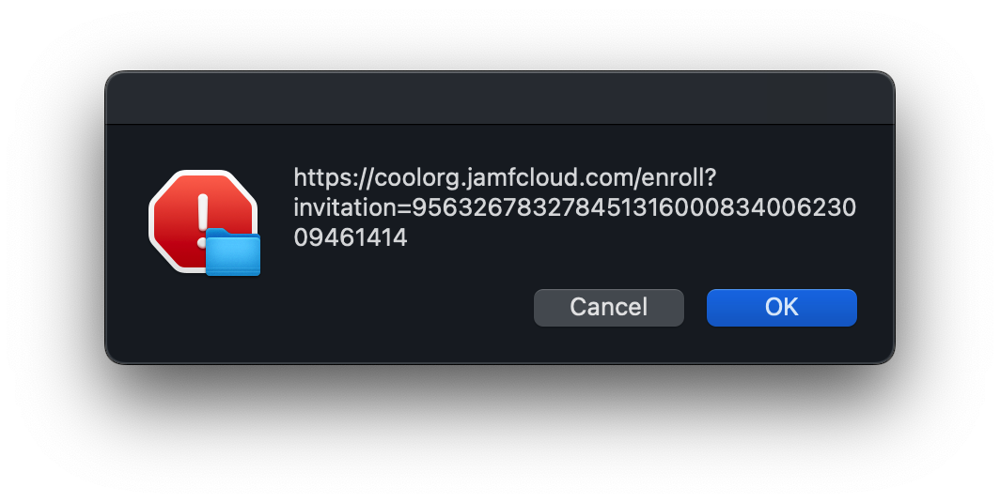

I manage a lot of diffirent Jamf enviroments and need make a enrollment url for automation or for endusers to enroll their devices.
I use the Enrollment Invitations in Jamf Pro.

Steps to create this.

1. Login to Jamf Pro
2. Go to Global setting (Gear icon top rigth)
3. Click SMTP server either configure a real SMTP or put in fake values to enable the Enrollment Invitations section in Jamf Pro.
 

  
  
   
4. Click Enrollment Invitations under Computers --> Enrollment Invitations
 

   
5. Click new --> type in a real email or fake one in my case I like to user app@none.com    
6. Click next --> leave this section alone --> next    
7. Pick the expiration date --> and check "Allow multiple uses" --> next    
8. (Note if you used fake values it will say it failed which is fine) Click Done    
9. Now under Enrollment Invitations click the one you just created.    
 

   
10. Copy the Invitation ID and copy your Jamf Pro url like https://myorg.jamfcloud.com    
11. Open this app Jamf Enrollment URL Generator.app and paste in the values.    
 

  
  
   
12. At the end of the app it will copy the url to your macOS clipboard.    
13. Done    
